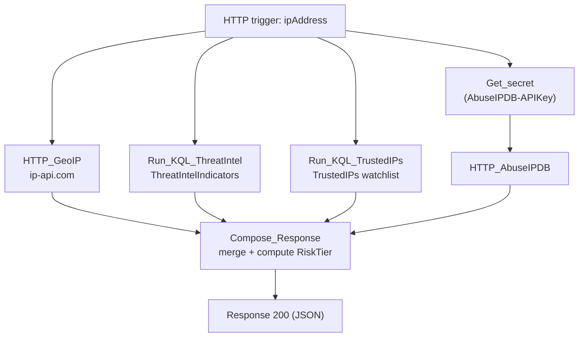

# C1-Enrich-IP

HTTP-triggered child playbook. Enriches a single IP address from GeoIP, AbuseIPDB,
Sentinel threat intel, and the `TrustedIPs` watchlist, then rolls the results into
a risk tier. Called by `P1-Universal-Enrichment` for every IP entity on an incident.

**Trigger body:** `ipAddress` (required), `incidentArmId`

**Response:** `RiskTier` (`Trusted` / `Low` / `Medium` / `High`) plus the raw
GeoIP, AbuseIPDB, and threat-intel fields it was derived from.

## Flow

GeoIP, threat intel, and the watchlist lookup run in parallel with the
AbuseIPDB call; `Compose_Response` waits on all four regardless of
success/failure/timeout so a single failed source degrades the result
instead of failing the whole enrichment.
