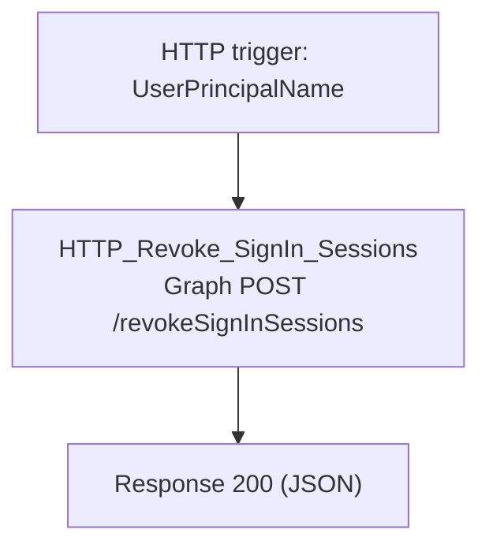

# C10-Revoke-Sessions

HTTP-triggered child playbook. Revokes all active sign-in sessions for a
user (`revokeSignInSessions` via Microsoft Graph), forcing re-authentication
everywhere. Called by every parent playbook as the first remediation step
once a user is flagged high-risk.

**Trigger body:** `UserPrincipalName` (required), `incidentArmId`

**Response:** `Success`, `StatusCode`, `RevokedAt`

## Flow

