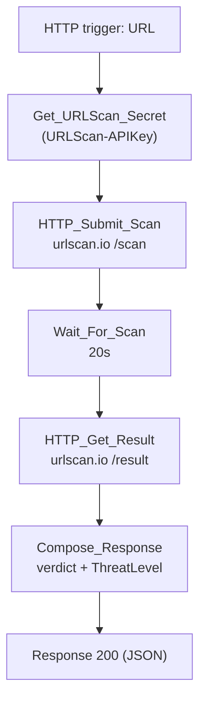

# C2-Enrich-URL

HTTP-triggered child playbook. Submits a URL to urlscan.io, waits for the scan
to finish, and returns a threat verdict. Called by `P2-UrlClick-SignIn` and
`P3-URL-Enrichment` for each URL entity/click found on an incident.

**Trigger body:** `URL` (required), `NetworkMessageId`, `incidentArmId`

**Response:** `ThreatLevel` (`Low` / `Medium` / `High`), `IsMalicious`,
`ThreatScore`, tags/categories, screenshot and scan report URLs.

## Flow

The 20-second wait is fixed, not polled — urlscan.io scans are async and
this playbook takes the best-effort result available at that point rather
than looping until `ScanComplete` is true.
