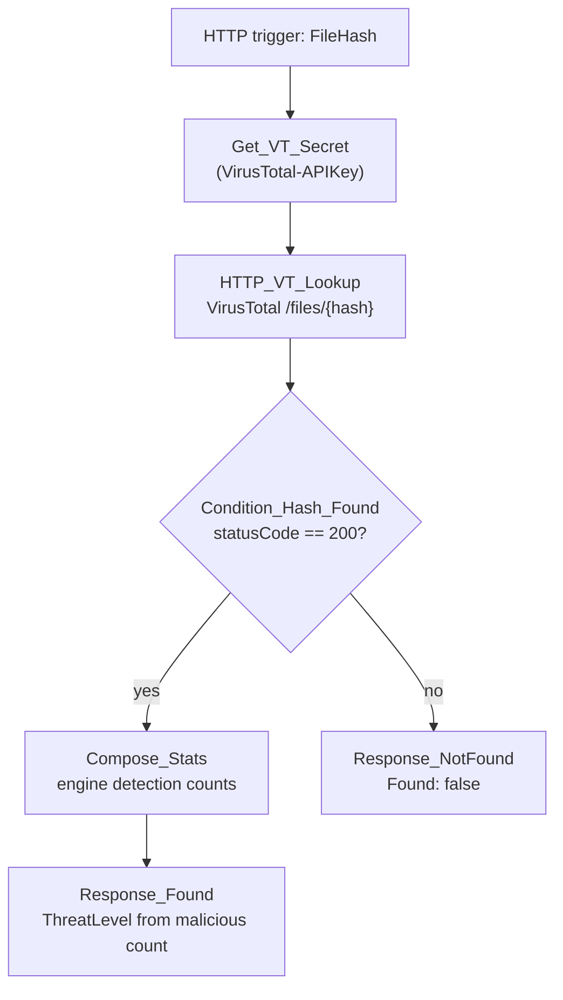

# C3-Enrich-Hash

HTTP-triggered child playbook. Looks up a file hash against VirusTotal and
returns an engine-detection summary. Not currently called by any parent
playbook in this repo — available for a future file/hash entity path.

**Trigger body:** `FileHash` (required), `HashType`, `incidentArmId`

**Response:** `ThreatLevel` (`Clean` / `Low` / `Medium` / `High`), `IsMalicious`,
malicious/suspicious/undetected engine counts, VirusTotal permalink.

## Flow

`ThreatLevel` is bucketed from the malicious-engine count: 15+ High,
5-14 Medium, 1-4 Low, 0 Clean.
