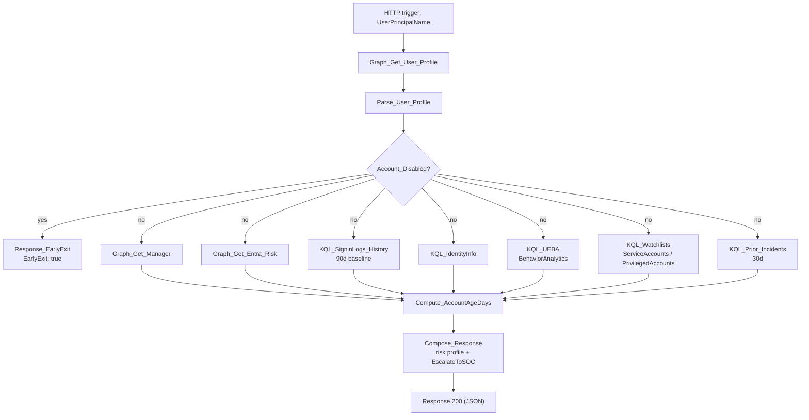

# C4-Enrich-User

HTTP-triggered child playbook. Builds a full risk profile for a user: Entra
profile/manager, Entra ID Protection risk, 90-day sign-in history, UEBA
investigation priority, `IdentityInfo`, watchlist membership
(`ServiceAccounts` / `PrivilegedAccounts`), and prior-incident count. The
most heavily used child — called by every parent playbook (`P1`, `P2`,
`P4`, `P5`) for each account entity.

**Trigger body:** `UserPrincipalName` (required), `incidentArmId`

**Response:** `EntraRiskLevel`, `InvestigationPriority`, `IsPrivilegedAccount`,
`IsServiceAccount`, `IsDormant`, `MFABypassRisk`, `EscalateToSOC`, plus
manager, sign-in history, and prior-incident fields. Short-circuits with
`EarlyExit: true` if the account is already disabled.

## Flow

`EscalateToSOC` is set when Entra risk is `high`, UEBA
`InvestigationPriority` exceeds 6, or the account is on the
`PrivilegedAccounts` watchlist — that flag is what parent playbooks branch
on to trigger session revocation and account disable.
