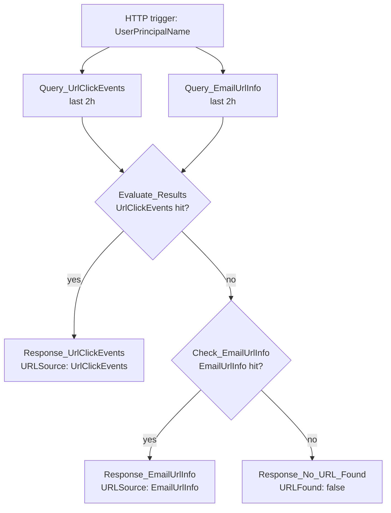

# C5-KQL-GetURL

HTTP-triggered child playbook. Finds the most recent URL a user interacted
with in the last 2 hours — first from Safe Links click telemetry
(`UrlClickEvents`), falling back to any URL that was simply delivered to
their inbox (`EmailEvents` joined to `EmailUrlInfo`). Called by
`P2-UrlClick-SignIn` to locate the URL to correlate against post-click
sign-ins.

**Trigger body:** `IncidentId`, `UserPrincipalName`

**Response:** `ClickedURL`, `NetworkMessageId`, `IsClickedThrough`,
`ClickTime`, `URLSource` (`UrlClickEvents` / `EmailUrlInfo`), `URLFound`.

## Flow

