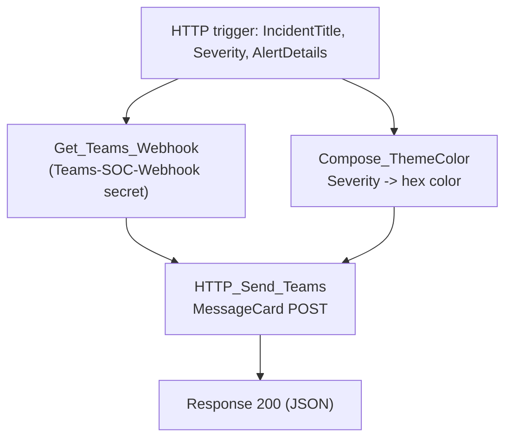

# C6-Notify-Teams

HTTP-triggered child playbook. Posts a SOC alert card to a Teams webhook,
color-coded by severity, with a deep link back to the incident in Sentinel.
Called by every parent playbook when it escalates an incident to High.

**Trigger body:** `IncidentTitle` (required), `Severity`, `AlertDetails`,
`IncidentUrl`, `IncidentId`

**Response:** `Success`, `StatusCode`, `SentAt`

## Flow

`Compose_ThemeColor` maps `High` → red, `Medium` → orange, `Low` → yellow,
anything else → Sentinel blue.
