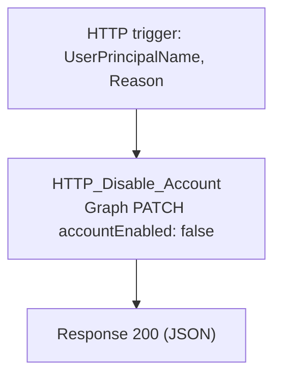

# C7-Disable-Account

HTTP-triggered child playbook. Disables a user's Entra account
(`accountEnabled: false` via Microsoft Graph). Called by parent playbooks
only for accounts already flagged both high-risk and privileged.

**Trigger body:** `UserPrincipalName` (required), `Reason`, `incidentArmId`

**Response:** `Success`, `StatusCode`, `Reason`, `DisabledAt`

## Flow

