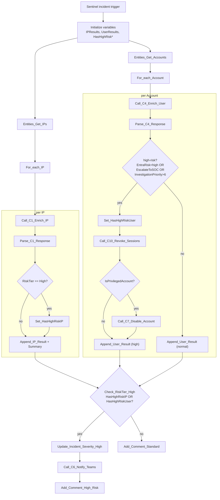

# P1-Universal-Enrichment

Sentinel-incident-triggered parent playbook. Runs on every incident
(the general-purpose baseline enrichment): pulls every IP and account
entity, enriches each in parallel via the child playbooks, escalates and
remediates if anything comes back high-risk, and always leaves a summary
comment on the incident.

**Trigger:** Microsoft Sentinel incident-creation webhook

**Calls:** `C1-Enrich-IP`, `C4-Enrich-User`, `C10-Revoke-Sessions`,
`C7-Disable-Account`, `C6-Notify-Teams`

## Flow

IP and account entities are enriched independently and in parallel; only
the final severity/comment step waits on both loops. A high-risk user gets
sessions revoked unconditionally, and the account disabled on top of that
only if it's also on the `PrivilegedAccounts` watchlist.
