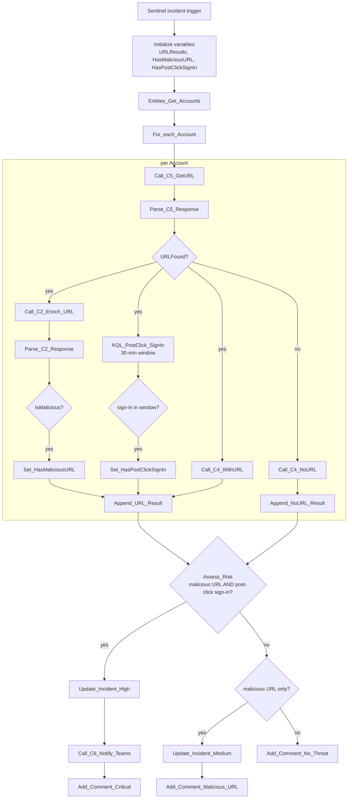

# P2-UrlClick-SignIn

Sentinel-incident-triggered parent playbook. For each account on the
incident, finds the URL they most recently interacted with and checks
whether a sign-in happened in the 30 minutes after the click — the
phishing-to-credential-use correlation. Escalates hardest when both a
malicious URL *and* a post-click sign-in are confirmed together.

**Trigger:** Microsoft Sentinel incident-creation webhook

**Calls:** `C5-KQL-GetURL`, `C2-Enrich-URL`, `C4-Enrich-User`,
`C6-Notify-Teams`

## Flow

