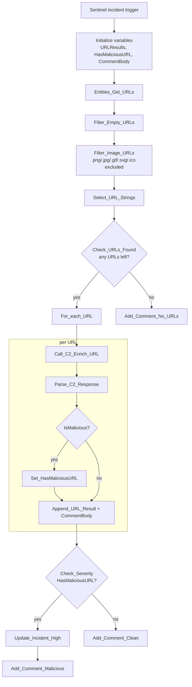

# P3-URL-Enrichment

Sentinel-incident-triggered parent playbook. Pulls every URL entity on the
incident, filters out empty/image URLs, scans what's left through
urlscan.io, and escalates the incident if any URL comes back malicious.

**Trigger:** Microsoft Sentinel incident-creation webhook

**Calls:** `C2-Enrich-URL`, `C6-Notify-Teams` (via the incident comment; no
direct notify call — severity/comment only)

## Flow

