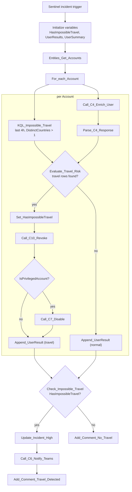

# P4-ImpossibleTravel

Sentinel-incident-triggered parent playbook. For each account on the
incident, checks the last 4 hours of sign-ins for successful logons from
more than one country — impossible/implausible travel — and remediates
immediately if found.

**Trigger:** Microsoft Sentinel incident-creation webhook

**Calls:** `C4-Enrich-User`, `C10-Revoke-Sessions`, `C7-Disable-Account`,
`C6-Notify-Teams`

## Flow

