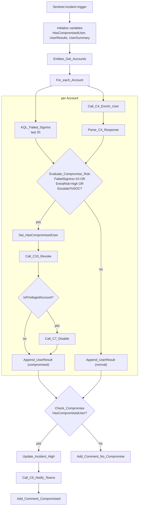

# P5-AccountCompromise

Sentinel-incident-triggered parent playbook. For each account on the
incident, checks the last 2 hours for brute-force-style failed sign-ins
(>10) or elevated Entra/UEBA risk, and remediates immediately if any
compromise threshold is met.

**Trigger:** Microsoft Sentinel incident-creation webhook

**Calls:** `C4-Enrich-User`, `C10-Revoke-Sessions`, `C7-Disable-Account`,
`C6-Notify-Teams`

## Flow

